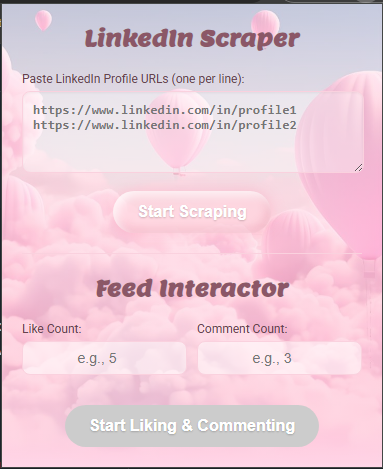

# Tab Title & Profile Grabber Extension

A full-stack Chrome extension that scrapes public data from LinkedIn profiles and saves it to a local backend server. This project demonstrates skills in both front-end extension development and backend API creation.

## Screenshot



## Tech Stack

### Frontend (Chrome Extension)

- **HTML5**: For the structure of the popup UI.
- **CSS3**: For custom styling, including a glassy button and themed background.
- **JavaScript (ES6)**: For UI logic, tab management, and DOM scraping using the Chrome APIs (`tabs`, `scripting`, `runtime`).
- **Google Fonts**: For custom 'Lemon' and 'Roboto' fonts.

### Backend (API Server)

- **Node.js**: The JavaScript runtime environment for the server.
- **Express.js**: A fast, minimalist web framework for building the API.
- **Sequelize**: A modern ORM (Object-Relational Mapper) for interacting with the database using JavaScript.
- **SQLite3**: A simple, file-based SQL database engine, perfect for local development.

## How to Run This Project Locally

This is a full-stack project with two parts that must be run simultaneously.

### 1. Run the Backend Server

- Navigate to the `backend` directory in your terminal:
  ```bash
  cd backend
  ```

- Install the required packages:
  ```bash
  npm install
  ```

- Start the server:
  ```bash
  node index.js
  ```

- The server will be running at http://localhost:3000. Leave this terminal open.

### 2. Load the Frontend Extension in Chrome

Open Google Chrome and navigate to chrome://extensions.
Enable "Developer mode" in the top-right corner.
Click "Load unpacked".
In the file selection window, navigate to and select the frontend folder.
The extension will now be loaded and active. You can pin it to your toolbar for easy access. 

### 3. Testing

To quickly test the scraping functionality, you can use the following public LinkedIn profile URLs. Copy this block and paste it into the extension's text area.
 ```bash
  https://www.linkedin.com/in/williamhgates/
  https://www.linkedin.com/in/satyanadella/
  https://www.linkedin.com/in/osamaelzero/
  ```