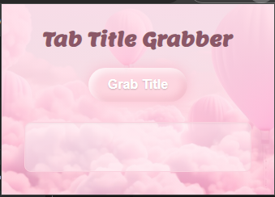

# Tab Title Grabber Extension

A simple but beautiful Chrome extension that grabs the title of the current browser tab with a single click. This project was built to practice front-end development skills, including JavaScript interaction with Chrome APIs and modern CSS design.

## Screenshot



## Tech Stack

- **HTML5**: For the structure of the popup.
- **CSS3**: For the custom styling, including the glassy button and themed background.
- **JavaScript (ES6)**: For the core logic and interacting with the Chrome Tabs API.
- **Google Fonts**: For the custom 'Lemon' and 'Roboto' fonts.

## How to Run This Project Locally

To test this extension on your own machine, follow these steps:

### Prerequisites

- You must have Google Chrome installed.

### Loading the Extension

1.  **Download or Clone:**
    - Download this project's code as a ZIP file and unzip it.
    - OR clone the repository to your local machine using Git:
      ```bash
      git clone https://github.com/Shaimaa01/tab-title-grabber-extension.git
      ```

2.  **Open Chrome Extensions Page:**
    - Open Google Chrome and navigate to `chrome://extensions` in the address bar.

3.  **Enable Developer Mode:**
    - In the top-right corner of the Extensions page, turn on the "Developer mode" switch.

4.  **Load the Extension:**
    - Click the "Load unpacked" button that appears on the top-left.
    - In the file selection window, navigate to and select the main `tab-title-grabber-extension` folder.
    - The extension will now be loaded and active! You can pin it to your toolbar for easy access.